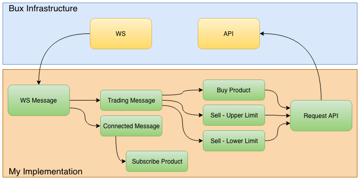

# Bux Trading Bot - Code Assignment

### App

This bot works by subscribing to a determinated product, given as input.It will keeps track of the prices of the product and
it will buy whenever the price reaches (at least) a defined value. After buying, it will still keep track of the price updates
in order to sell if this reaches a defined maximum or minimum value.

After this process, it starts over again.

### Implementation Architecture



### Application initialization

As requirement for this app, one should be able to, on startup, configure the app. There are 2 main blocks of configuration. The first
one is related to the environment where the app should connect to and respective authorization headers. The second one is related to
the product configuration, which product to subscribe for market updates and upper and lower limits to buy and sell.


#### **First configuration block**

```
bux.api.uri=https://api.beta.getbux.com/
bux.ws.uri=wss://rtf.beta.getbux.com/subscriptions/me

bux.authorization.header=Bearer JWT
bux.language.header=nl-NL,en;q=0.8
```

#### Second configuration block

```
trading.product.id=sb26493
#trading.product.id=sb26496
#trading.product.id=sb26502
#trading.product.id=sb26500
#trading.product.id=sb26513
#trading.product.id=sb28248
trading.product.buying.price=10040
trading.product.upper.limit.price=10050
trading.product.lower.limit.price=10030
```

Only one `trading.product.id` can be active at a time.